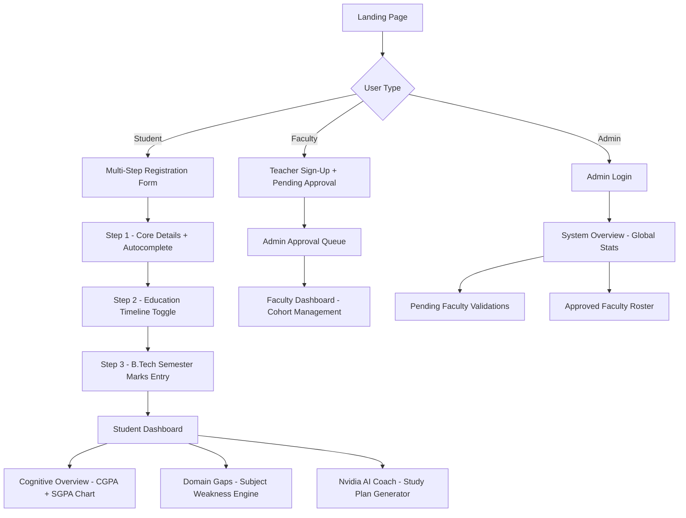

<div align="center">


# eval**X**

### *Cognitive Academic Runtime for CV Raman Global University*

[](https://developer.mozilla.org/en-US/docs/Web/HTML)
[](https://developer.mozilla.org/en-US/docs/Web/CSS)
[](https://developer.mozilla.org/en-US/docs/Web/JavaScript)
[](https://gsap.com)
[](https://build.nvidia.com)

[](LICENSE)
[](https://github.com/noobcoder1982/evalx)
[](https://cvrgu.edu.in)
[](https://github.com/noobcoder1982/evalx)

---

> **evalX** is a zero-dependency, browser-native academic diagnostics platform that tracks student performance across multi-qualification timelines, calculates CGPA/SGPA, surfaces subject weaknesses, and routes grade records through Nvidia Llama 3 cloud inference to generate personalized study plans — all in a single `index.html`.

---

</div>

## ✦ What Is evalX?

evalX is a full-featured **student performance intelligence system** engineered for CV Raman Global University. It eliminates the friction of scattered academic records by centralising every qualification milestone — from 10th standard through active B.Tech semesters — into a single, AI-augmented diagnostic dashboard.

The platform serves **three distinct user classes**:

| Role | Access | Capability |
|------|--------|-----------|
| 🎓 **Student** | Self-registration | Log qualifications, view CGPA, receive AI study plans |
| 👨‍🏫 **Faculty** | Admin-approved | Inspect student rosters, manage cohort seat caps |
| 💻 **Admin** | Credential-gated | Approve faculty, view system-wide deployment stats |

---

## 🗂️ Project Architecture

```
evalx/
├── index.html              ← Entire application (SPA, ~1500 lines)
├── favicon.svg             ← Brand favicon (pure SVG, no font deps)
├── Student_records.xlsx    ← Master student record for autocomplete
└── src/
    ├── index.css           ← Swiss Brutalist design system (~1400 lines)
    ├── app.js              ← Application runtime (~2500 lines)
    ├── student_records.js  ← XLSX parser + autocomplete engine
    ├── collaborative_learning.png  ← Hero section image
    └── join_bg.png         ← Join section wavy background
```

### Application Flow



---

## 🚀 Feature Deep-Dive

### 🧠 Student Diagnostics Engine

The core of evalX. Students register through a **4-step guided wizard**:

1. **Core Particulars** — Name, Registration Number, Branch, Group, College
   - Real-time **autocomplete** powered by `Student_records.xlsx` parsing
   - Fuzzy match on name AND registration number simultaneously

2. **Education Timeline** — Interactive toggle grid for:
   - ✅ 10th Standard *(always required)*
   - 🔲 12th Standard
   - 🔲 ITI Vocational *(with trade + score fields)*
   - 🔲 Diploma *(stream, CGPA, weak subject flags)*

3. **B.Tech Semester Marks** — Dynamic tab bar (Sem 1 → Sem N)
   - Per-subject marks entry per active semester
   - Auto-detects semesters from academic calendar
   - "Grades fully published" checkbox gates the current semester

4. **Prior Schooling Marks** — Board, percentage/CGPA for each unlocked tier

### 📈 CGPA / SGPA Computation

- **SGPA** calculated per semester using subject-wise credit-weighted algorithm
- **CGPA** aggregated across all completed semesters
- SGPA Trend **SVG line chart** drawn dynamically via canvas-style SVG path math
- Weakness threshold: subjects scoring **< 50%** flagged in the domain gap engine

### 🤖 Nvidia NIM AI Coach

evalX integrates with **Nvidia's cloud inference API** (Llama 3 models):

```
Student grade record → Compiled academic ledger → Nvidia NIM endpoint
                                                          ↓
                                        Personalized study plan (streamed)
```

- No API key → falls back to **static local compilation** (offline mode)
- Key stored in `localStorage`, never transmitted to any third-party
- AI Config modal accessible from every dashboard view

### 👥 Faculty & Admin Portals

**Faculty Dashboard:**
- View all students in their assigned group
- Inspect individual student academic dossiers (modal popup)
- Set & save cohort seat capacity targets
- Trigger AI analysis for individual students

**Admin Dashboard:**
- Approve / manage pending faculty registration requests
- Global stats: total teachers, students, pending approvals
- Full approved faculty roster

---

## 🎨 Design System

evalX is built on a **Swiss Brutalist** design language:

```css
/* Core Design Tokens */
--bg-brutal:     #f6f5ef   /* Warm cream        */
--bg-card:       #ffffff   /* Pure white cards  */
--border-brutal: #000000   /* Thick black border*/
--border-width:  3px

--color-yellow:  #ffe600   /* Primary accent    */
--color-green:   #00ffa2   /* Success / mint    */
--color-pink:    #ffc0e6   /* Student portal    */
--color-blue:    #a3e2ff   /* Faculty portal    */
--color-danger:  #ff4747   /* Error / X mark    */

--font-display:  'Space Grotesk'  /* Headings   */
--font-mono:     'Space Mono'     /* Labels     */
```

### Bento Box Layout

```
╔═══════════════════════════════════════════╗  ← Navbar (sticky pill)
║  ✦ evalX    Overview · Diagnostics · ...  ║
╚═══════════════════════════════════════════╝
┌──────────────────────────────────────────────────────┐
│  Hero Card         │   Geometric image cutout frame  │
│  Engineering a new │   (yellow organic blob border)  │
│  academic paradigm │                                 │
└──────────────────────────────────────────────────────┘
┌────────────────────────────────────────────────────────────┐
│  ████████████ Don't just trust. Verify. ████████████████   │  ← Scroll blur reveal
└────────────────────────────────────────────────────────────┘
┌──────────┐ ┌──────────┐ ┌────────────┐
│  Yellow  │ │  Green   │ │    Pink    │  ← Feature bento cards
│ Academic │ │   AI     │ │  Faculty   │
│ Logging  │ │  Coach   │ │  Portal    │
└──────────┘ └──────────┘ └────────────┘
┌─────────────────────┐ ┌────────────────────┐
│ 🩷 Student Engine   │ │ 🩵 Faculty Desk    │  ← Portal split
└─────────────────────┘ └────────────────────┘
┌──────────────────────────────────────────────────────┐
│  ~~~ Join Banner ~~~ (Groovy wavy background image)  │  ← Dark + yellow CTA
└──────────────────────────────────────────────────────┘
┌──────────────────────────────────────────────────────┐
│  Footer · Links · Copyright · Socials                │
└──────────────────────────────────────────────────────┘
```

### Animation System

| Element | Animation |
|---------|-----------|
| **Preloader** | Spinning yellow arc ring + pulsing evalX logo → slides up off-screen |
| **Hero Title** | GSAP blur-in (`filter: blur(18px)` → `0`) + Y translate |
| **Section headings** | IntersectionObserver blur + translateY reveal on scroll |
| **Scroll text** | GSAP character-level scrub un-blur (ScrollTrigger) |
| **Image mockup** | Mouse-parallax rotation (rotationX/Y on hover) |
| **Buttons** | Neo-brutalist flat-shadow shift on press |

---

## ⚡ Quick Start

evalX is a **zero-build, zero-dependency** application. No `npm install`. No bundlers.

```bash
# 1. Clone the repository
git clone https://github.com/noobcoder1982/evalx.git
cd evalx

# 2. Serve locally (any static server works)
python -m http.server 8000
# or: npx serve .
# or: just open index.html directly in Chrome

# 3. Open in browser
open http://localhost:8000
```

> **Nvidia AI features** require a free API key from [build.nvidia.com](https://build.nvidia.com). Without a key, evalX uses a local static fallback — all other features work fully offline.

---

## 🔑 Demo Credentials

For local development / demo testing:

| Role | Email | Password |
|------|-------|----------|
| Admin | `admin@evalx.in` | `admin123` |
| Faculty | Register → await admin approval | — |
| Student | Register directly | — |

> ⚠️ Change admin credentials before deploying to production.

---

## 🛠️ Tech Stack

| Technology | Purpose | Why |
|-----------|---------|-----|
| **Vanilla HTML/CSS/JS** | Core runtime | Zero build complexity, maximum portability |
| **GSAP 3.12** | Hero + scroll animations | Industry-leading animation engine |
| **ScrollTrigger** | Scroll-bound reveals | Precise viewport-based animation triggers |
| **Space Grotesk** | Display typography | Modern geometric grotesk, premium feel |
| **Space Mono** | Mono tags / labels | Technical, brutalist mono aesthetic |
| **Nvidia NIM API** | AI study plan generation | Free-tier cloud Llama 3 inference |
| **SheetJS (XLSX)** | Student record parsing | Parse `.xlsx` without a server |
| **IntersectionObserver** | Section blur reveals | Native, zero-dep scroll detection |
| **localStorage** | Data persistence | No backend required for demo |

---

## 📁 Data Model

Student data is persisted to **`localStorage`** as JSON:

```json
{
  "studentName": "Priyadarshi Nayak",
  "regNo": "230120104",
  "branch": "CSE",
  "group": "4",
  "college": "CV Raman Global University",
  "qualifications": {
    "10th":    { "board": "BSE Odisha", "score": 92.5 },
    "12th":    { "board": "CHSE",       "score": 88.0 },
    "diploma": null,
    "iti":     null
  },
  "btechSemesters": {
    "1": [
      { "subject": "Engineering Mathematics I", "marks": 78, "maxMarks": 100 },
      { "subject": "Physics",                   "marks": 65, "maxMarks": 100 }
    ]
  },
  "cgpa": 7.84,
  "weakSubjects": ["Applied Mathematics", "Data Structures"]
}
```

---

## 🏗️ Roadmap

- [x] Multi-step student registration wizard
- [x] CGPA / SGPA calculation engine
- [x] Subject weakness detection (< 50% threshold)
- [x] Nvidia NIM AI coach integration
- [x] Faculty portal + cohort management
- [x] Admin approval system
- [x] Student autocomplete from `.xlsx` records
- [x] Swiss Brutalist bento layout
- [x] Preloader + scroll blur animations
- [x] Custom SVG favicon
- [ ] Export student report as PDF
- [ ] Email notification on faculty approval
- [ ] Dark mode toggle
- [ ] Comparative batch analytics charts
- [ ] Multi-university / multi-department support

---

## 🤝 Contributing

This project was built for CV Raman Global University's Department of CSE.

```bash
# 1. Fork the repo
# 2. Create a feature branch
git checkout -b feat/your-feature

# 3. Make changes and commit
git commit -m "feat: describe your change"

# 4. Push and open a Pull Request
git push origin feat/your-feature
```

Please follow the existing **Swiss Brutalist** design language and avoid introducing external CSS frameworks.

---

## 📜 License

```
MIT License — Copyright © 2026 evalX Runtime System

Permission is hereby granted, free of charge, to any person obtaining
a copy of this software to use, copy, modify, merge, publish, and
distribute without restriction.
```

---

<div align="center">

**Built with ⚡ for CV Raman Global University · Department of CSE**

*Engineering a new academic paradigm.*

[](https://github.com/noobcoder1982/evalx)

</div>
